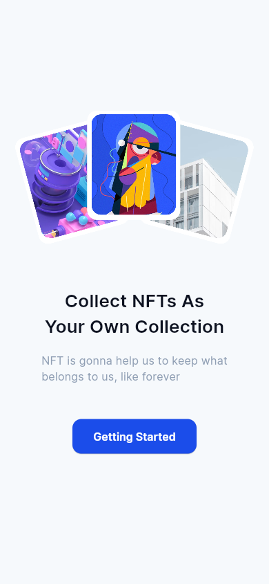

# Simple NFT

A comprehensive NFT Marketplace Flutter application featuring browsing, bidding, and account management screens.

<p align="center">
  
  
  
</p>

## Features

- **Get Started**: Introductory screen with smooth navigation.
- **Sign In**: User authentication UI with responsive layout.
- **Discover**: Browse popular bids and categories with horizontal scrolling lists.
- **Theme Support**: Centralized theme management for consistent styling (Dark/Light mode ready architecture).
- **Responsive**: Scrollable layouts to support various screen sizes.

## Getting Started

### Prerequisites

- Flutter SDK 3.0.0 or higher.
- Dart SDK 3.0.0 or higher.

### Installation

1.  Clone the repository.
2.  Install dependencies:
    ```bash
    flutter pub get
    ```

### Running the App

To run the application on a connected device or emulator:

```bash
flutter run
```

### Testing

To run the test suite:

```bash
flutter test
```

## Project Structure

- `lib/pages`: Contains the application screens (`GetStarted`, `SignIn`, `Discover`).
- `lib/widgets`: Reusable UI components (`NftCard`, `BrowseCard`, `Footer`).
- `lib/models`: Data models (`Nft`, `Browse`).
- `lib/theme.dart`: Application theme configuration and constants.
- `lib/main.dart`: Application entry point.

## Improvements & Audit Log

This project has been audited and improved with the following:
- Upgraded to Flutter 3 and Dart 3.
- Modernized widget usage (replaced `RaisedButton` with `ElevatedButton`).
- Implemented robust `ThemeData` architecture.
- Fixed UI overflow issues on smaller screens (added scrolling, flexible layouts).
- Added comprehensive Widget tests for key user flows.
- Enforced strict linting rules for code quality.
